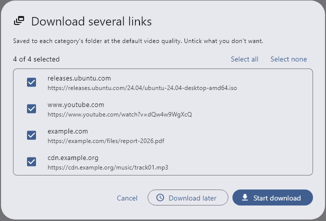
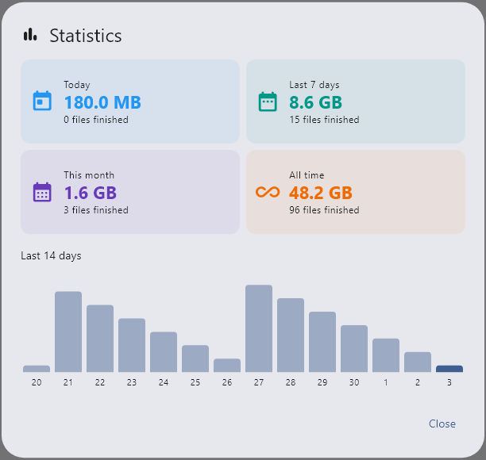
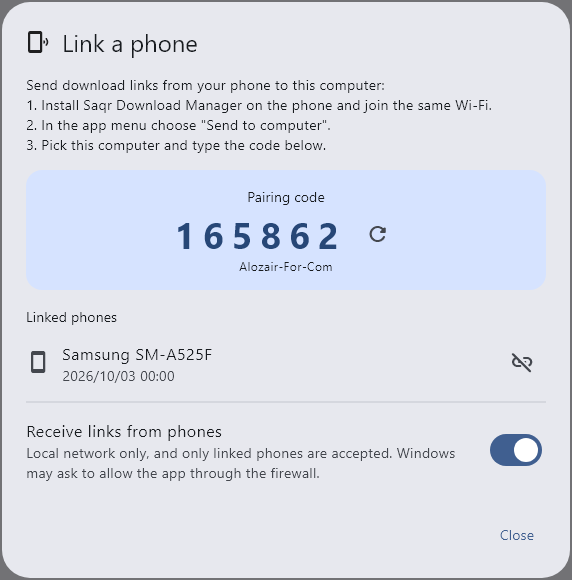
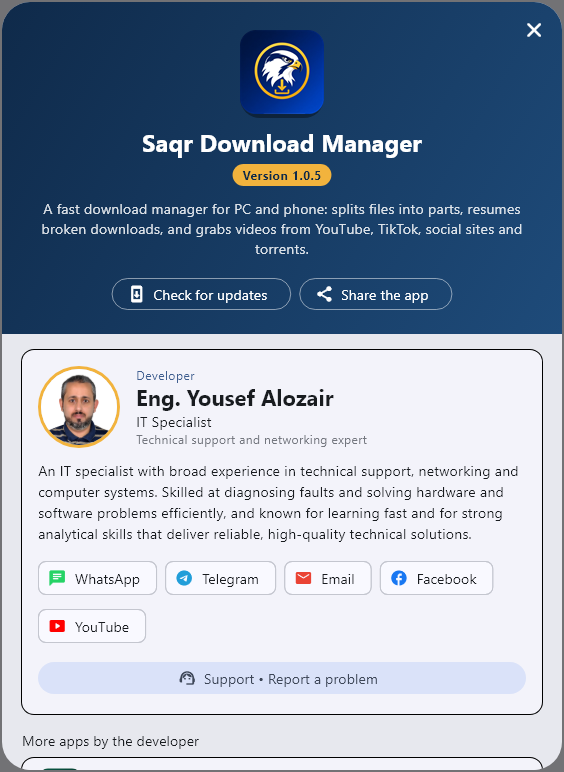

# Saqr Download Manager · صقر للتحميل

**A fast download manager for Windows and Android**

[**Download the latest version**](https://github.com/yalozair/QDM-Releases/releases/latest)

[English](#english) · [العربية](#العربية)

---

## English

Saqr Download Manager speeds up your downloads, resumes them when the connection drops, and saves videos from your favorite sites, on both your computer and your phone.

### Features

- **Faster downloads**: files are split into up to 32 parallel connections.
- **Resume anytime**: broken or paused downloads continue where they stopped, even after a restart.
- **Video and audio**: save media from 1000+ supported websites in the quality you choose, with optional subtitles (for content you own or have permission to download).
- **Whole playlists** in one step.
- **Torrents and magnet links**, with file selection.
- **Browser integration** (Chrome, Edge, Firefox): downloads and videos are caught automatically.
- **Send links from your phone to your computer** over the same Wi-Fi.
- **Scheduler and queue**: start downloads at night, shut down when done, limit the speed during work hours.
- **Batch links**, **file verification** (MD5 / SHA-1 / SHA-256), **statistics**, **proxy** support.
- Arabic and English interface, light and dark themes.

### Screenshots

  
  
  
  

### Download

| Platform | File |
|---|---|
| Windows 10 / 11 (64-bit) | `QDM-Setup-x.y.z.exe` |
| Android (most phones) | `QDM-x.y.z-arm64-v8a.apk` |
| Android (older phones) | `QDM-x.y.z-armeabi-v7a.apk` |

Get them from the [Releases page](https://github.com/yalozair/QDM-Releases/releases/latest). The app updates itself from here.

### License

Saqr Download Manager is free to try with every feature for **3 months**. After that you can keep using a free version with limits (lower speed and video quality, one download at a time), or buy a license key:

- **Lifetime license**: pay once, updates included.
- **Yearly license**: renews every year.

Payments are handled securely by [Lemon Squeezy](https://www.lemonsqueezy.com). The license key arrives by email and is entered in the app under **Help → Activation**. Each key works on 1 computer and 1 phone.

[Terms of use and privacy](TERMS.md) · [Refund policy (14-day money-back)](REFUND.md)

### Support

- Email: [yalozair2013@gmail.com](mailto:yalozair2013@gmail.com)
- WhatsApp: [+967 773 640 964](https://wa.me/967773640964)
- Telegram: [@Eng_yousifalozair](https://t.me/Eng_yousifalozair)
- YouTube: [@yalozair](https://www.youtube.com/@yalozair)

---

## العربية

صقر للتحميل يسرّع تحميلاتك، ويكملها إذا انقطع الاتصال، ويحفظ الفيديو من مواقعك المفضلة، على الكمبيوتر والجوال.

### الميزات

- **تحميل أسرع**: يُقسَّم الملف إلى حتى 32 اتصالاً متوازياً.
- **استئناف في أي وقت**: التحميلات المتوقفة أو المنقطعة تكمل من حيث توقفت، حتى بعد إعادة التشغيل.
- **الفيديو والصوت**: حفظ الوسائط من أكثر من 1000 موقع مدعوم، بالجودة التي تختارها، مع ترجمة اختيارية (للمحتوى الذي تملكه أو لديك إذن بتحميله).
- **قوائم التشغيل كاملة** بخطوة واحدة.
- **التورنت وروابط المغناطيس** مع اختيار الملفات.
- **التكامل مع المتصفح** (كروم وإيدج وفايرفوكس): يلتقط التحميلات والفيديو تلقائياً.
- **إرسال الروابط من الجوال إلى الكمبيوتر** عبر نفس شبكة Wi-Fi.
- **الجدولة وقائمة الانتظار**: التحميل ليلاً، وإيقاف الجهاز عند الانتهاء، وتحديد السرعة في أوقات العمل.
- **عدة روابط دفعة واحدة**، و**التحقق من الملفات**، و**الإحصائيات**، ودعم **البروكسي**.
- واجهة عربية وإنجليزية، ووضع فاتح وداكن.

### التحميل

من [صفحة الإصدارات](https://github.com/yalozair/QDM-Releases/releases/latest):

- **ويندوز 10 / 11**: `QDM-Setup-x.y.z.exe`
- **أندرويد** (أغلب الأجهزة): `QDM-x.y.z-arm64-v8a.apk`
- **أندرويد** (الأجهزة القديمة): `QDM-x.y.z-armeabi-v7a.apk`

البرنامج يحدّث نفسه تلقائياً من هذه الصفحة.

### الترخيص

جرّب صقر للتحميل بكل ميزاته مجاناً لمدة **3 أشهر**. بعدها يمكنك الاستمرار بنسخة مجانية محدودة (سرعة وجودة فيديو أقل، وتحميل واحد في كل مرة)، أو شراء مفتاح ترخيص:

- **ترخيص مدى الحياة**: دفعة واحدة مع التحديثات.
- **ترخيص سنوي**: يتجدد كل سنة.

الدفع آمن عبر [Lemon Squeezy](https://www.lemonsqueezy.com)، ويصلك المفتاح بالبريد وتُدخله من **مساعدة ← التفعيل**. كل مفتاح يعمل على كمبيوتر واحد وجوال واحد.

[شروط الاستخدام والخصوصية](TERMS.md) · [سياسة الاسترجاع (ضمان 14 يوماً)](REFUND.md)

### الدعم

- البريد: [yalozair2013@gmail.com](mailto:yalozair2013@gmail.com)
- واتساب: [‎+967 773 640 964](https://wa.me/967773640964)
- تيليجرام: [@Eng_yousifalozair](https://t.me/Eng_yousifalozair)

---

© 2026 Yousif Alozair

